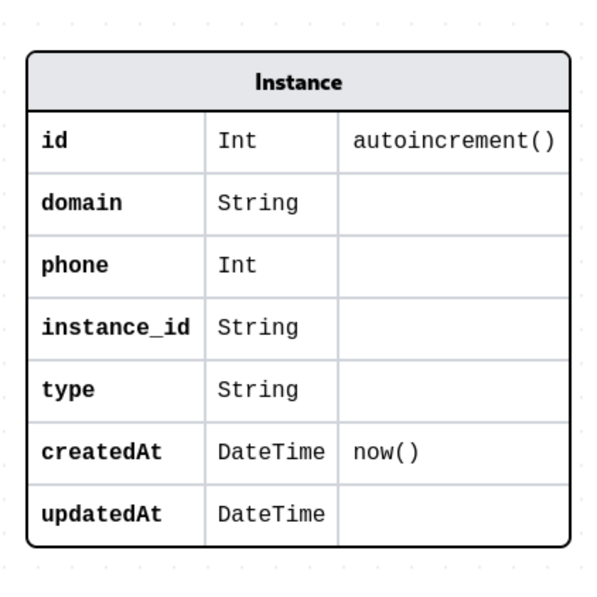

# Swagger

Exemplo da utilização do **Swagger** em uma API **Nest**

## Tecnologias utilizadas

     
     
## Tabela instances



## API

- Iniciar o servidor

```bash
npm run start:dev
```

Irá startar a API em: **http://localhost:3000/**

## Prisma

Visualizar os models do db: **https://prismaliser.app/**

## Swagger

Após configurado, o Swagger estará disponível em: **http://localhost:3000/api#/**

---

<p align="center">Projeto desenvolvido por [Klecianny Melo](https://www.linkedin.com/in/kecbm/) 😁</p>